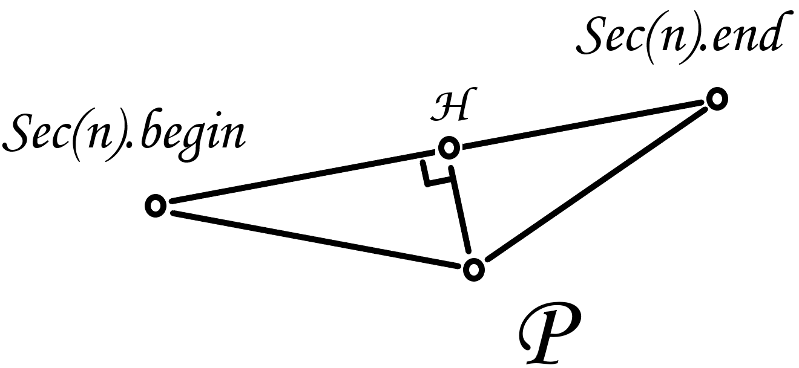

# Race Plus Plus 技术文档

## 基本功能

Race Plus Plus（以下简称RPP）的游戏逻辑十分简单，基本逻辑只有两条：

* 功能方块：当玩家站立在功能方块上时执行配置文件中指定的对应功能
* 赛程任务：当玩家完成整个赛程（或每一圈）时执行配置文件中指定的任务

::: warning
如果不实现下面的高级功能，那么可以使用功能方块来实现赛程任务，但因为RPP实现了高级功能，且使用高级功能来实现赛程任务更方便快捷，故本文不会介绍用功能方块来实现赛程任务的方法
:::

## 功能方块

RPP的功能方块不外乎两大类：

* 效果类
* 弹射类

其中效果类功能方块实现较为简单，只需要在玩家站立在相应功能方块上时给予玩家相应效果即可。

::: tip
要获取玩家所**站立**的方块，只需要查询玩家的坐标取整后再将y轴减去1后坐标对应的方块类型即可。
但实际上在RPP中我们默认不仅会查询玩家脚下的方块，而且还会在玩家脚下方块并非功能方块时继续查找更靠下的一个方块（这是为了防止漏判），其获取方法同上，只需要将y轴再减去1即可
:::

而弹射类方块实现相对较难，我们的目标是：
* 当玩家站立在弹射类功能方块上时，根据其配置文件中指定的**横向力度**与**纵向力度**，将玩家向正前方弹射

::: warning
这里弹射时的方向是玩家的朝向，与配置文件无关
:::

可以发现，这个要求很像是击飞，而击飞实际上就是击退+纵向速度，所以我们开始寻找关于击打（Knock）的关键词。

我们可以在源码中找到这些相关代码：
```java
package net.minecraft.entity;

public abstract class LivingEntity extends Entity {
    //省略了部分方法
    public void takeKnockback(double strength, double x, double z) {
        strength *= 1.0 - this.getAttributeValue(EntityAttributes.GENERIC_KNOCKBACK_RESISTANCE);
        if (!(strength <= 0.0)) {
            this.velocityDirty = true;
            Vec3d vec3d = this.getVelocity();
            Vec3d vec3d2 = (new Vec3d(x, 0.0, z)).normalize().multiply(strength);
            this.setVelocity(vec3d.x / 2.0 - vec3d2.x, this.onGround ? Math.min(0.4, vec3d.y / 2.0 + strength) : vec3d.y, vec3d.z / 2.0 - vec3d2.z);
        }
    }
    //省略了部分方法
    protected void knockDownwards() {
        this.setVelocity(this.getVelocity().add(0.0, -0.03999999910593033, 0.0));
    }
    //省略了部分方法
}
```
分析可以发现，MC的击退，受伤时反重力这些设定都是依靠**Velocity**实现的。

::: warning
你可以把这个Velocity理解为一个给玩家的**力度**，这会让玩家“飞起来”，和ArC使用的代理服务端Velocity**不是**一个东西。

**但是实际上Velocity是玩家的实时动量，并会在下一tick被使用。**
这里这么说只是为了方便理解。
:::

我们可以看到MC已经给我们实现了平面击退的轮子（takeKnockback方法），那么这个轮子怎么用呢？

我们先来看传入的参数：```double strength, double x, double z```

根据名字就能猜出分别是弹射力度，x轴相对力度，z轴相对力度。

但是我们知道的是横向力度与方向，怎么转换为方法的三个参数呢？
实际上我们只需要对大小为横向力度，方向为玩家方向的这个**矢量**进行[极坐标](https://baike.baidu.com/item/%E6%9E%81%E5%9D%90%E6%A0%87/7607962)转换[直角坐标](https://baike.baidu.com/item/%E7%9B%B4%E8%A7%92%E5%9D%90%E6%A0%87/9455590)即可。

此时我们如果将这个思路实现，进行测试会发现，弹射方向与我们想要的方向**正好相反**，这是因为MC的击退是由其他实体进行对本实体的，因此方向相反，我们只需将传入的参数均**乘上-1**即可。

## 高级功能

RPP的高级功能大致有以下几个：
1. 获取玩家在赛道上的位置（即玩家已经完成的赛道的长度）
2. 获取玩家当前排名
3. 获取玩家与附近玩家的时间差与位置差
4. 获取玩家当前圈数
5. 获取玩家当前速度
6. 将上述数据用计分板显示给每个玩家

:::tip
若要计算时间差的玩家为$P$，目标玩家为$Pg$，那么
* 当$P$的排名高于$Pg$时，时间差为$P$到达$Pg$当前所在位置的时间减去当前时间
* 当$P$的排名低于$Pg$时，时间差为当前时间减去$Pg$到达$P$当前所在位置的时间
:::

看起来很多，但实际上，2-5号功能都可以由1号功能做到，而6号功能在[ArgonLibrary](/ArgonLibrary-Dev)中直接就有对应实现（好吧我承认这个库本来就是为了ArC设计的），因此实际上我们只需要实现1号功能即可。

:::tip
* 知道了所有玩家的位置，自然就知道了排名和位置差
* 只要记录玩家到达每个整数位置的时间，就能算出时间差与玩家速度
* 圈数也能用位置除以每圈长度再取整来算出
:::

### 计算前的准备

RPP的真实游戏地图十分复杂，尽管赛道相对封闭，但整个赛程弯曲度高，且上下起伏，甚至还有近道的设计，用简单的距离计算几乎不可能获取准确的玩家位置。

为了方便计算的同时减少地图录入工作量，我们将赛道抽象为一条**折线段**，称为抽象赛道（与其对应的是真实赛道），这样录入时只需要录入**折线段**的各个顶点即可。

当然，在尽量贴合真实赛道的前提下，抽象赛道顶点**越少**越好。

:::warning
RPP有多圈赛道的设计，但是输入时只需要输入**第一圈**的所有顶点和总圈数，RPP会自动补全剩余的所有顶点
:::

:::danger
无论如何，**不要**让抽象赛道出现**小于等于90°的夹角**，并且尽量使用大于120°的夹角。
小于等于90°的夹角很可能会导致计算出现严重错误
:::

### 概念定义

* 可以看出，抽象赛道被分为了很多条**直线段**（假设每圈有$N$条线段，共$M$圈），那么我们称第$n( n \in [1,N \times M]$)个直线段为赛段$n$，记为$Sec(n)$，且靠近起始点的端点叫做该赛段的起始点（记为$Sec(n).begin$），相应的远离起始点的端点叫做该赛段的结尾点（记为$Sec(n).end$），并规定$Sec(n)$的长度为$Sec(n).begin$到$Sec(n).end$的距离(记为$Sec(n).length$)。
* 我们在每个赛段的起始点做一个与赛段相垂直的二维平面，称为**该赛道**的空间判定平面，若一个玩家$P$位于$Sec(n)$的空间判定平面与$Sec(n+1)$的空间判定平面所夹的空间中，那么称该点属于$Sec(n)$，同时称$Sec(n)$包含$P$，记为$P \in Sec(n)$。

:::tip
容易看出，一个玩家可以同时属于多个赛段，这样显然无法计算位置，这个冲突将会在后面进行处理
:::

### 如何判断位于那个赛段？

上面提到，单纯根据**属于**的定义无法确定一个玩家$P$到底位于那个赛段，因此我们需要维护一个数据，存储了$P$**上一次**位于的赛段的**编号**（记为$P.lastSec$），即$P$上一次位于$Sec(P.lastSec)$，且该值默认为1。

那么我们只需要根据就近原则，将最近一个包含$P$的赛段$Sec(x)$指定为当前赛段即可。（当然，需要同时设置$P.lastSec$为$n$）

:::warning
虽然不推荐这么做，但是抽象赛道确实可能存在$Sec(n)$，使得$P \in Sec(n+1)$且$P \in Sec(n-1)$ 。很明显，在这种情况下，我们希望取$Sec(n+1)$。

在实际代码中，我们的实现方法是采用一种特殊的遍历方式，其遍历顺序如下（起始点为$n$）:

$n$,$n+1$,$n-1$,$n+2$,$n-2$......

同时如果遍历的元素小于1或大于元素总数，那么跳过这个元素继续遍历，直到连续两次跳过（即遍历完成）或找到符合的元素。

通过这种遍历方式，我们能较好的解决上述问题。
:::

### 计算玩家在赛段中的位置

:::tip
玩家在赛段中的位置即：玩家所在点到某赛段的垂点到该赛段起始点的距离
:::

:::center



:::

:::tip
上图中$B$点代表$Sec(n).begin$,$E$点代表$Sec(n).end$，且我们规定一个点$A$到另一个点$B$的长度为A.disTo(B)
:::

如上图，我们可以看到，在某一赛段$Sec(n)$中，我们要计算一个玩家$P$在赛段中的位置，很明显即计算线段$BH$的长度。由于我们已知$BE$，$BP$，$EP$，因此这个长度可以通过简单的数学计算得到。

:::tip
BE即$Sec(n).begin.disTo(Sec(n).end)$

BP即$Sec(n).begin.disTo(P)$

EP即$Sec(n).end.disTo(P)$
:::

设玩家$P$在$Sec(n)$中的位置为$P.posAt(Sec(n))$，那么我们可以得到这个式子：（因原式太长，故没有替换$BE$,$BP$与$EP$）
$$P.posAt(Sec(n))=\frac{(BP+EP)(BP-EP)}{2BE}+\frac{BE}{2}$$

:::details 数学推导
在$Rt\triangle PHB$与$Rt\triangle PHE$中,由勾股定理得：
$$\begin{cases}
BH^{2}=BP^{2}-PH^{2}\\
EH^{2}=EP^{2}-PH^{2}
\end{cases}$$
进一步得：
$$\begin{cases}
PH^{2}=BP^{2}-BH^{2}\\
PH^{2}=EP^{2}-EH^{2}
\end{cases}$$
联立得：
$$BP^{2}-BH^{2}=EP^{2}-EH^{2}$$
由图像得$EH=BE-BH$,代入上式得：
$$ BP^{2}-BH^{2}=EP^{2}-(BE-BH)^{2}$$
$$BP^{2}-BH^{2}=EP^{2}-BE^{2}+2BE\cdot BH-BH^{2}$$
$$BP^{2}-EP^{2}+BE^{2}=2BE\cdot BH$$
$$BH=\frac{BP^{2}-EP^{2}+BE^{2}}{2BE}$$
$$BH=\frac{BP^{2}-EP^{2}}{2BE}+\frac{BE}{2}$$
$$BH=\frac{(BP+EP)(BP-EP)}{2BE}+\frac{BE}{2}$$
:::

### 最后结果

现在我们通过上面的步骤得到了玩家$P$所在的赛段$Sec(n)$，$P.posAt(Sec(n))$，那么我们只需要计算


$$Sec(1).length+Sec(2).length+...+Sec(n-1).length+P.posAt(Sec(n))$$

便得到了最终的玩家位置，记为$P.pos$。

:::tip
RPP使用了前缀和来加快计算
:::

::: theorem 前缀和
顾名思义，是要求前缀的总和，什么是前缀，对于一个存放数字的数组而言，前缀就是指的数组的前k项，因此对应的前缀和就是数组前k项的和。前缀和一般用来求数组中连续段子数组的值的和，类似于等差数列中利用等差数列的和来求某一段子数列的和。
:::